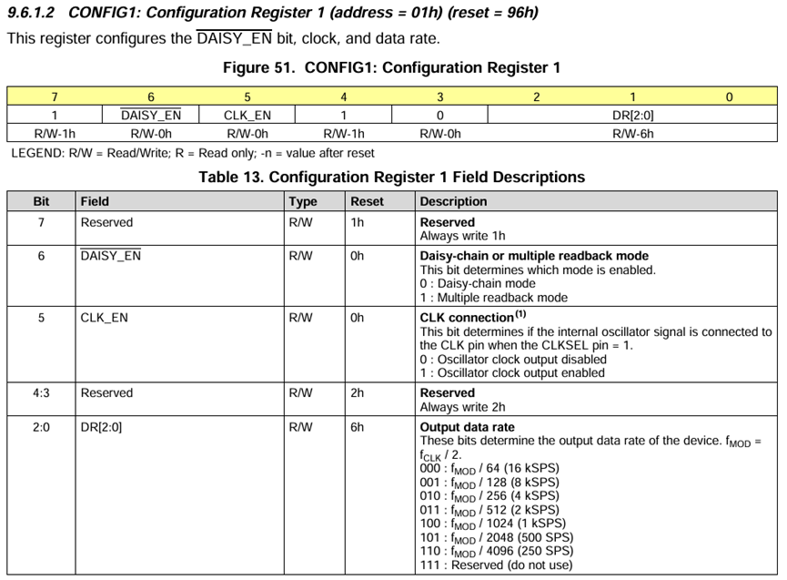
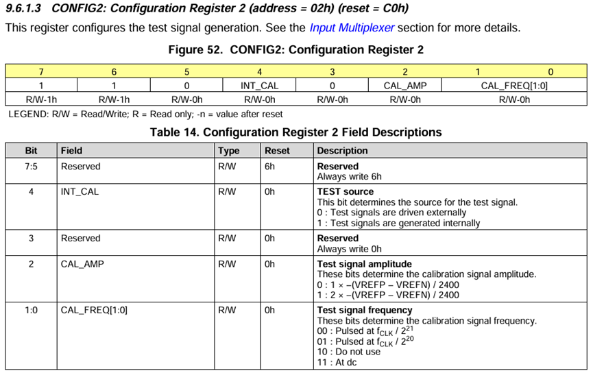
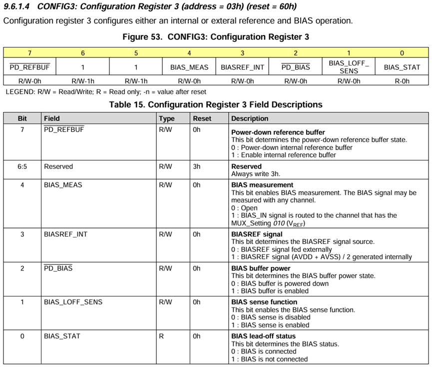
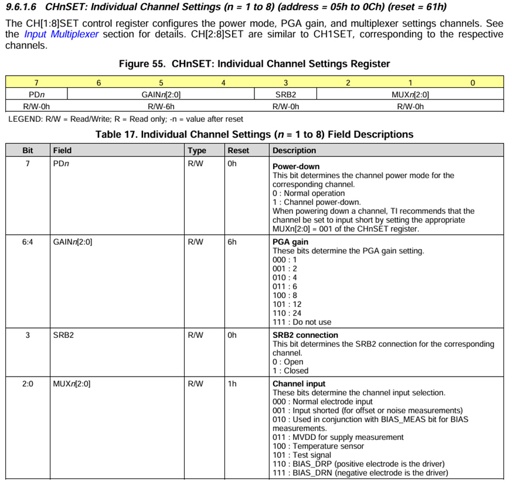
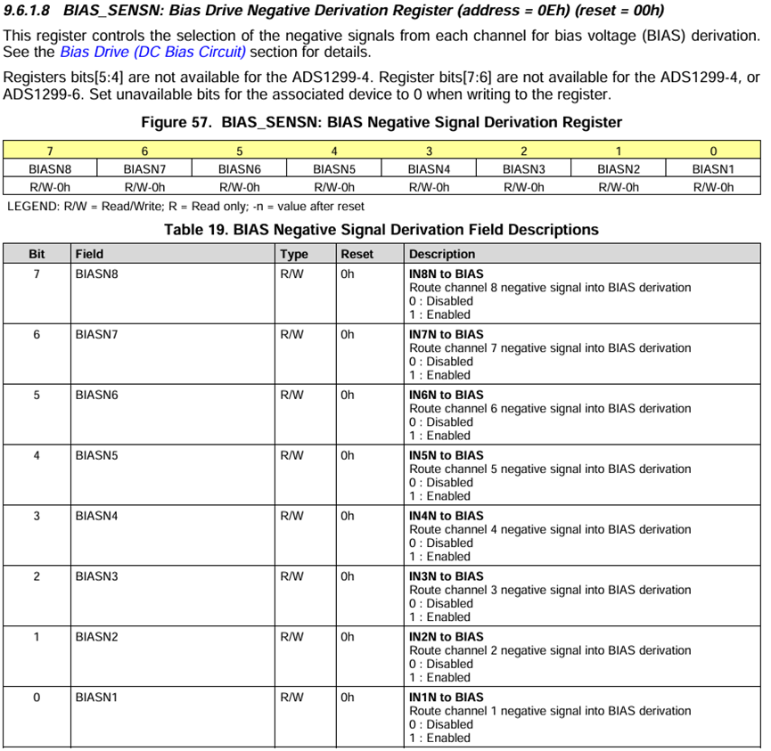
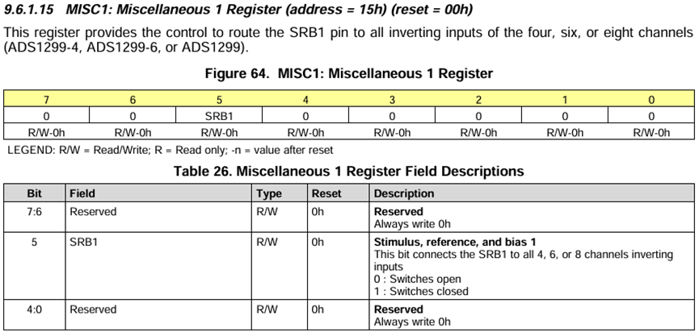

# 1、EEG Acquisition system decription
*最多支持24通道，采用级联法：共用SPI接口，3个CS片选引脚。*
*MOSI：PB15 (SPI2)*
*MISO：PB14 (SPI2)*
*SCLK：PB13 (SPI2)*
*CS1：  PB 12*
*DRDY：PC6*
*START：PC7*
*RESET：PC8*
*（级联另外两片）：*
*CS2：PA12*
*CS3：PA11*

*文件ads1299v3.2为前端信号采集驱动代码，不同的采集模式主要通过配置寄存器来实现。主要配置方法参考如下：*

*采集信号采用单端模式，即对于关注信号只需要连接正电极即可，需要配置所有的IN×N引脚共同连接到SRB1用于给系统提供稳定的零点为参考点。对于脑电信*号，通常用右耳垂作为参考电极（REF），对于心电信号，则是右大腿。此外，还需连接偏置/驱动电极来抑制共模干扰，通常连接至受试者的腿部。
*文件eeg_realtime_plot_v2.0.py则是接收前端采集信号的python脚本代码，其中的配置需结合前端采集模式进行灵活修改。该代码实现实时的信号接收、压值转换、滤波（高通滤波、陷波滤波与滑动窗口滤波）、保存与绘制。*
