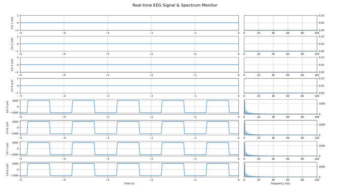
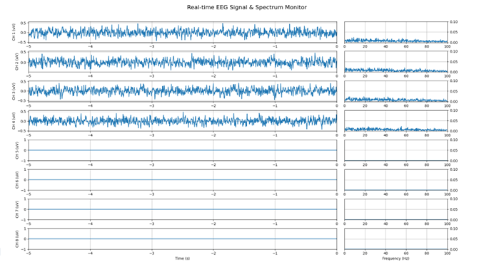
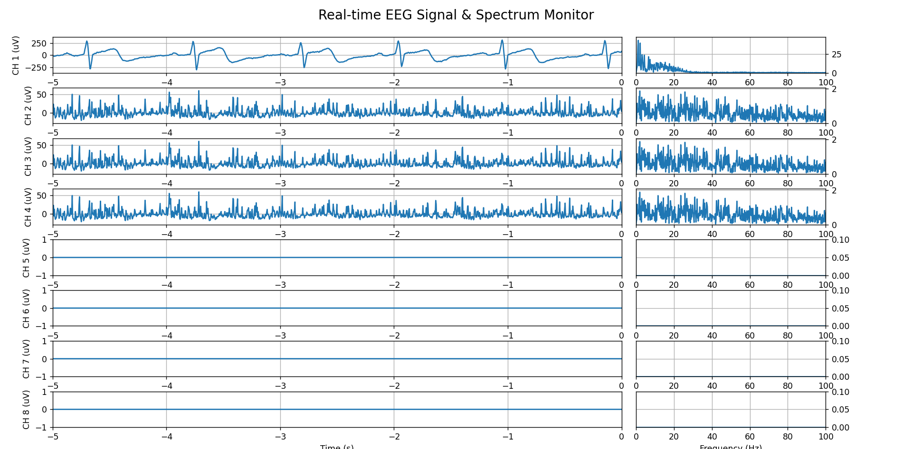
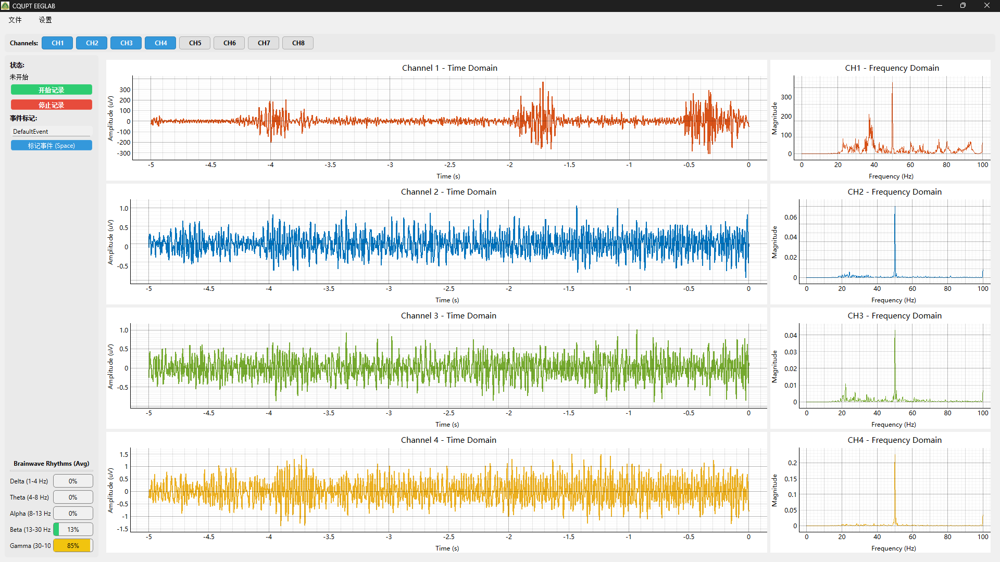
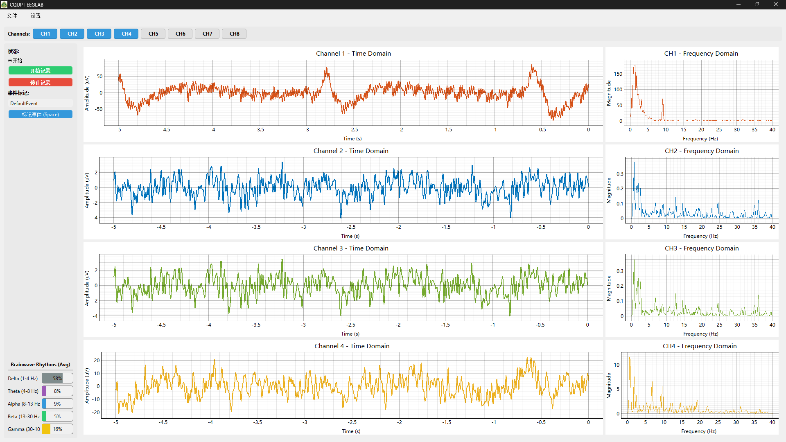
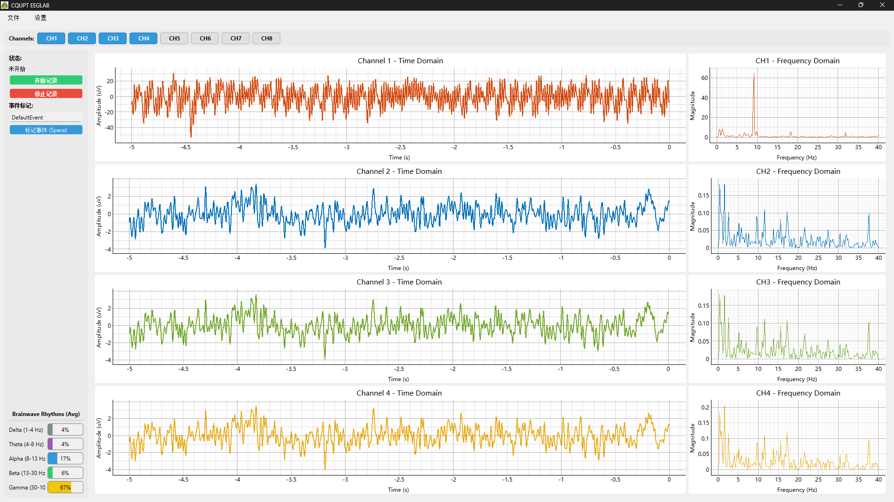

# 1、EEG Acquisition System Description
*本EEG信号采集系统采用STM32F405RGT6作为主控，模数转换芯片采用TI的具有高精度8通道的ADS1299，另外结合WiFi模块用于传输数据。本系统采用外部±2.5V参考电压，最多支持24通道，采用级联法：共用SPI接口，3个CS片选引脚。*  
*MOSI：PB15 (SPI2)*  
*MISO：PB14 (SPI2)*  
*SCLK：PB13 (SPI2)*  
*CS1：  PB 12*  
*DRDY：PC6*  
*START：PC7*  
*RESET：PC8*  
*（级联另外两片）：*  
*CS2：PA12*  
*CS3：PA11*  

*文件ads1299v3.2为前端信号采集驱动代码，不同的采集模式主要通过配置寄存器来实现。主要配置方法参考如下：*  

*采集信号采用单端模式，即对于关注信号只需要连接正电极即可，需要配置所有的IN×N引脚共同连接到SRB1用于给系统提供稳定的零点为参考点。对于脑电信号，通常用右耳垂作为参考电极（REF），对于心电信号，则是右大腿。此外，还需连接偏置/驱动电极来抑制共模干扰，通常连接至受试者的腿部。*  
*文件eeg_realtime_plot_v2.0.py则是接收前端采集信号的python脚本代码，其中的配置需结合前端采集模式进行灵活修改。该代码实现实时的信号接收、压值转换、滤波（高通滤波、陷波滤波与滑动窗口滤波）、保存与绘制。*  
#  2、System Performance Evaluation
###  internal test signal
  
*从这张图片可以看出内部测试信号可以完美的采集到，并且噪音小，幅度吻合*  
###  shorted input to get background noise
  
*根据参考手册的提示，在输入短路模式下所采集到的信号为系统的本底噪声。在增益为24，±2.5V参考电压的背景下，系统的本底噪声处于1uV的范围内，性能还算可以*  
###  ECG Test
  
*如图所示的通道一为采集到的心电信号波形图。心电信号主要由P波（心房收缩）、QRS波群（心室收缩）和T波（心室舒张）组成，幅度范围为-0.5mV到+2.0mV之间。经验证该信通可以采集较为精确心电信号*  
### EMG Test
 
*如图所示的通道一为采集到的肌电信号波形图。该图反映整个系统可以准确采集肌电信号，观察右侧的频率波形，也能体现出典型的肌电信号频域特征*  
### EOG Test
  
*如图所示的通道一为采集到的眼动伪影波形图。图中可以看出眼动信号可以被准确采集*  
### EEG Test

*如图所示的通道一为采集到的脑电信号波形图。此图中可以清晰看到10Hz频率附近幅度明显，这就是Alpha波。*  